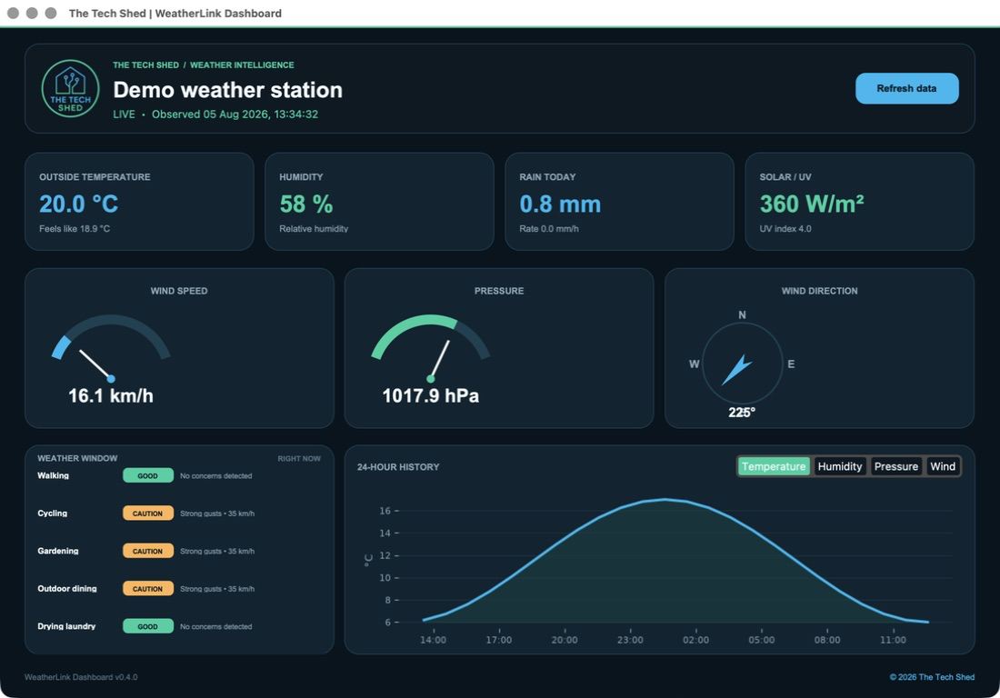

# WeatherLink Dashboard

A modern, cross-platform Python desktop dashboard for Davis Instruments weather stations connected to WeatherLink. It presents live observations with gauges, a wind-direction dial, metric cards, and selectable history graphs.

Branded for **The Tech Shed** using its original cyan, teal, and deep-navy visual identity.

 



## Features

- Live temperature, humidity, rainfall, solar radiation, and UV readings
- Wind-speed and barometric-pressure gauges plus a compass dial
- Selectable 24-hour charts for temperature, humidity, pressure, and wind
- Weather Window guidance for walking, cycling, gardening, outdoor dining, and laundry
- Accessible good, caution, avoid, and unavailable states based on current local observations
- Metric and imperial display modes
- Automatic first-station discovery or an explicit station ID
- Background network requests so the interface remains responsive
- Friendly handling when a WeatherLink plan does not include historical data
- Credentials loaded only from a local `.env` file, which Git ignores
- Installed version and a clickable The Tech Shed repository link in the dashboard footer
- Packaged The Tech Shed logo, window icon, and cohesive professional brand theme

## Setup

1. Install Python 3.10 or newer.
2. From [your WeatherLink account page](https://www.weatherlink.com/account), generate a v2 API key and secret.
3. Create and activate a virtual environment:

   ```bash
   python3 -m venv .venv
   source .venv/bin/activate       # macOS/Linux
   # .venv\Scripts\activate        # Windows PowerShell
   ```

4. Install the app:

   ```bash
   pip install -e .
   ```

5. Copy the configuration template and edit the new file:

   ```bash
   cp .env.example .env
   ```

   Set `WEATHERLINK_API_KEY` and `WEATHERLINK_API_SECRET`. Leave `WEATHERLINK_STATION_ID` blank to use the first station available to the account. The station ID is not the device ID; it may be an integer or UUID.

6. Launch:

   ```bash
   weatherlink-dashboard
   # or: python -m weatherlink_dashboard.app
   ```

## Optional Raspberry Pi kiosk mode

The Raspberry Pi installer always installs the application, but it does **not** configure automatic startup unless you explicitly pass `--enable-kiosk`.

On Raspberry Pi OS with a desktop environment:

```bash
git clone https://github.com/willcurtis/weatherlink-dashboard.git
cd weatherlink-dashboard

# Normal installation; no startup service is created or enabled:
./scripts/install_raspberry_pi.sh

# Opt-in kiosk installation; creates and enables the systemd service:
./scripts/install_raspberry_pi.sh --enable-kiosk
```

The script creates `.env` from the safe template if it does not exist. Add your credentials, then start the enabled service without rebooting:

```bash
systemctl --user start weatherlink-dashboard.service
journalctl --user -u weatherlink-dashboard.service -f
```

The kiosk uses a per-user systemd service started by the graphical desktop session. It inherits the active Wayland or XWayland environment rather than assuming an X11 display, automatically restarts after a failure, and remains disabled unless the install switch is supplied. Raspberry Pi OS should be configured to log the desktop user in automatically so a graphical display is available. Press `Escape` to leave fullscreen or `F11` to toggle it.

To disable and remove the service later:

```bash
systemctl --user disable --now weatherlink-dashboard.service
rm ~/.config/systemd/user/weatherlink-dashboard.service
rm ~/.config/autostart/weatherlink-dashboard.desktop
systemctl --user daemon-reload
```

## macOS application

Each GitHub release can provide native macOS disk images for Apple Silicon and Intel. Download the DMG for your Mac, open it, and drag **WeatherLink Dashboard** into **Applications**. The application includes Python and all required libraries.

On first launch, a branded setup window asks for the WeatherLink v2 API key, API secret, and optional station ID. Credentials are stored outside the application bundle at:

```text
~/Library/Application Support/WeatherLink Dashboard/.env
```

The file is restricted to the current user. Existing environment variables and repository-local `.env` files continue to take precedence.

### Building a DMG locally

```bash
python3 -m venv .venv
source .venv/bin/activate
pip install '.[dev,packaging]'
./scripts/build_macos.sh
```

The output is written to `dist/WeatherLink-Dashboard-<version>-macOS-<architecture>.dmg`. Without an Apple identity the local build is ad-hoc signed and macOS may display a Gatekeeper warning on another computer.

### Signed and notarized releases

The release workflow builds separate `arm64` and `x86_64` packages. To enable public Developer ID signing and Apple notarization, configure these GitHub Actions secrets:

| Secret | Purpose |
| --- | --- |
| `MACOS_CERTIFICATE_BASE64` | Base64-encoded Developer ID Application `.p12` |
| `MACOS_CERTIFICATE_PASSWORD` | Password protecting the `.p12` |
| `MACOS_KEYCHAIN_PASSWORD` | Temporary CI keychain password |
| `MACOS_SIGN_IDENTITY` | Full Developer ID Application identity |
| `APPLE_ID` | Apple ID used by `notarytool` |
| `APPLE_TEAM_ID` | Apple Developer Team ID |
| `APPLE_APP_PASSWORD` | App-specific password for notarization |

When those secrets are absent the workflow still produces testable ad-hoc-signed DMGs; it never stores signing or WeatherLink credentials in the repository.

## Configuration

| Variable | Required | Default | Description |
| --- | --- | --- | --- |
| `WEATHERLINK_API_KEY` | Yes | — | WeatherLink v2 API key |
| `WEATHERLINK_API_SECRET` | Yes | — | WeatherLink v2 secret, sent only as a request header |
| `WEATHERLINK_STATION_ID` | No | First station | Integer station ID or UUID |
| `WEATHERLINK_REFRESH_SECONDS` | No | `60` | Refresh cadence; minimum 30 seconds |
| `WEATHERLINK_HISTORY_HOURS` | No | `24` | History window from 1–24 hours |
| `WEATHERLINK_UNITS` | No | `metric` | `metric` or `imperial` |
| `WEATHERLINK_CONFIG_FILE` | No | Platform default | Explicit path to a credential file |

The `.env` file is excluded by `.gitignore`. Finder-installed builds use the platform application-data path shown above. Do not commit it, paste credentials into source code, or pass the API secret in a URL. If a secret is exposed, regenerate it from WeatherLink immediately.

## WeatherLink API notes

This project uses the official WeatherLink v2 endpoints `/stations`, `/current/{station-id}`, and `/historic/{station-id}`. API access and observation freshness depend on station ownership and the WeatherLink subscription. Historical access may not be available on Basic plans. The API currently limits historical request windows to 24 hours and applies account-level request limits, so the dashboard defaults to one refresh per minute.

Official references: [authentication](https://weatherlink.github.io/v2-api/authentication), [API reference](https://weatherlink.github.io/v2-api/api-reference), [data permissions](https://weatherlink.github.io/v2-api/data-permissions), and [rate limits](https://weatherlink.github.io/v2-api/rate-limits).

## Development

```bash
pip install -e '.[dev]'
pytest
ruff check .
```

Sensor models expose slightly different WeatherLink field names. The normalizer deliberately supports common WeatherLink Live, Console, EnviroMonitor, WeatherLinkIP, and Vantage Connect variants. Contributions with sanitized sample payloads are welcome.

Weather Window ratings use only the latest station observations; they are practical guidance, not a forecast. The panel shows the most important current concern for each activity, changes to an unavailable state when all relevant readings are missing, and suspends guidance when observations are more than 30 minutes old.

## License

MIT. See [LICENSE](LICENSE).
